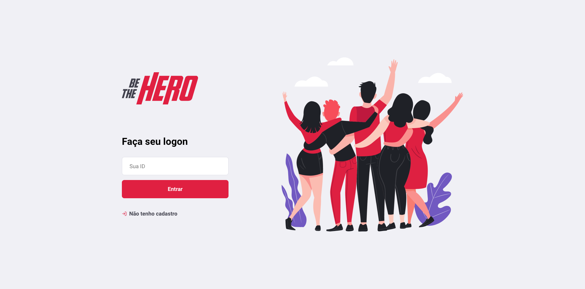
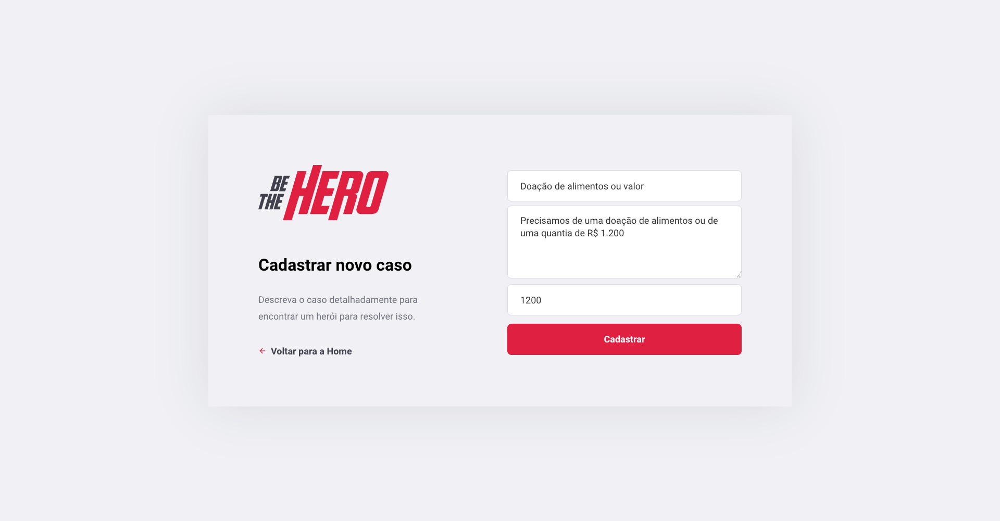
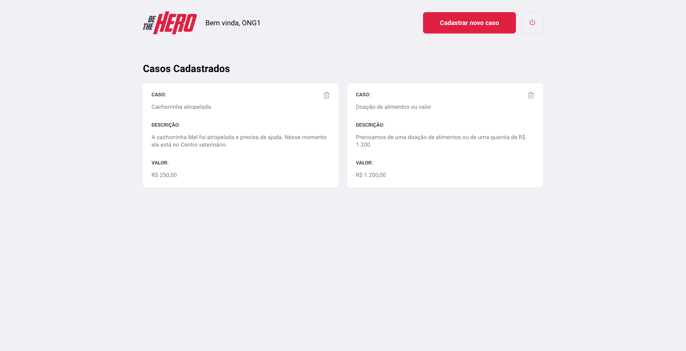
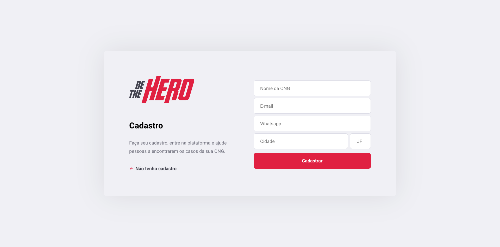

<h1 align="center">
    
</h1>

<h4 align="center"> 
	🚀 Semana OmniStack 11.0 Rocketseat - Projeto Be The Hero para que uma pessoa possa ajudar um caso.
</h4>

  

  
	
  

  

  

<a aria-label="Completed" href="https://rocketseat.com.br/week-10/aulas#4">
    </img>
  </a>
  

  <a href="#-project">Project</a>&nbsp;&nbsp;&nbsp;|&nbsp;&nbsp;&nbsp;
  <a href="#rocket-Technologies">Technologies</a>&nbsp;&nbsp;&nbsp;|&nbsp;&nbsp;&nbsp;
  <a href="#-layout">Layout</a>&nbsp;&nbsp;&nbsp;|&nbsp;&nbsp;&nbsp;
  <a href="#-how-to-contribute">How to contribute</a>&nbsp;&nbsp;&nbsp;|&nbsp;&nbsp;&nbsp;
  <a href="#memo-license">License</a>

## :computer: Technologies

This project was developed with the following technologies:

- [Node.js](https://nodejs.org/en/) 
- [React](https://reactjs.org)
- [React Native](https://facebook.github.io/react-native/)
- [Expo](https://expo.io/)

## 💻 Project

Be The Hero is a project that aims to connect people who are willing to help ONGs.

<h1 align="center">
    
</h1>

## New Incident
<h1 align="center">
    
</h1>

## List Incidents (Cases)
<h1 align="center">
    
</h1>

## Register new Ong
<h1 align="center">
    
</h1>

## 🔖 Layout

Para acessar o layout utilize a ferramenta [Figma](https://www.figma.com/file/2C2yvw7jsCOGmaNUDftX9n/Be-The-Hero---OmniStack-11?node-id=0%3A1).

## 🤔 How to contribute

- Make a fork;
- Create a branck with your feature: `git checkout -b my-feature`;
- Commit changes: `git commit -m 'feat: My new feature'`;
- Make a push to your branch: `git push origin my-feature`.

After merging your receipt request to done, you can delete a branch from yours.

## :memo: License

This project is under the MIT license. See the [LICENSE](LICENSE.md) for details.

---

Made with ♥ by Marcus Paulo :wave: [Get in touch!](https://www.linkedin.com/in/marcuspaulo/)